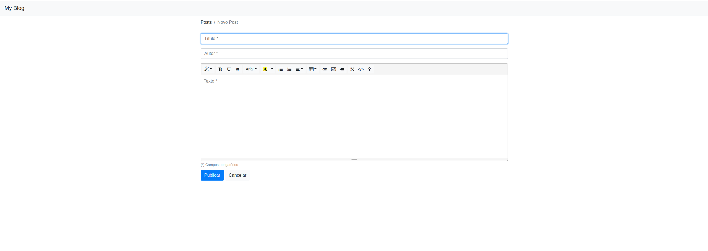
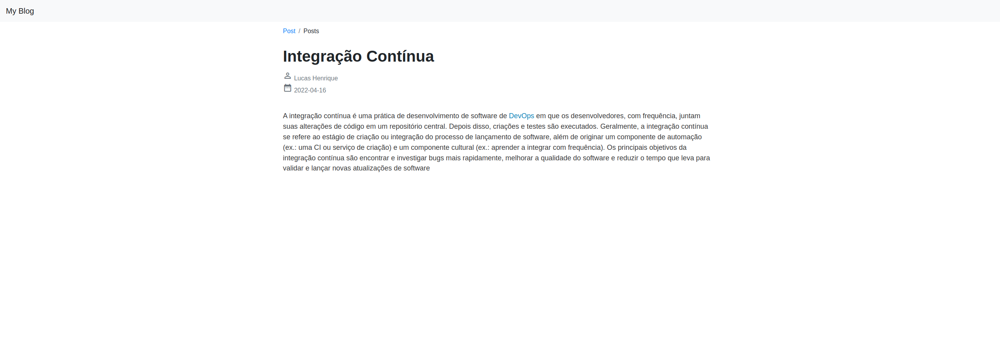

# Spring Blog

Blog pessoal para publicar posts construído com Spring Boot com as ferramentas:

- Thymeleaf
- Bootstrap
- PostgreSQL
- Spring Security

## Novos aprendizados
- Conceito de injeção de dependências
- Conceito de Repository
- Templates com Thymeleaf

### Telas

    
    
    

